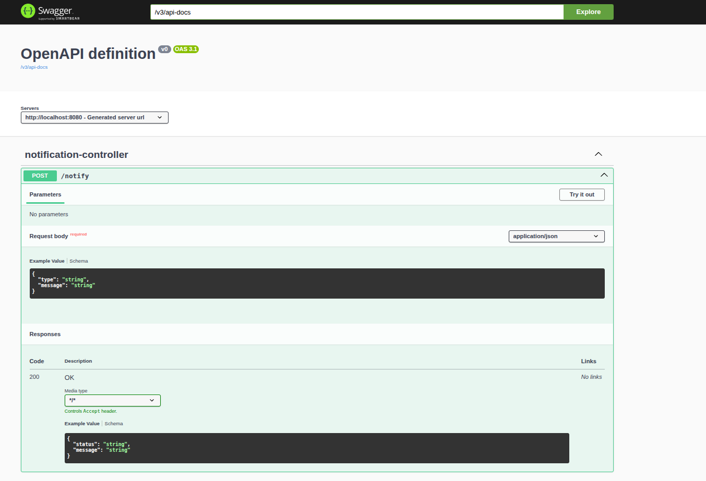

# spring-notification-api

Java Spring Boot project demonstrating Interfaces, Dependency Injection, Strategy Pattern and REST API best practices through a multi-channel notification system.

---

## 📌 Overview

This project simulates a notification platform capable of sending messages through different channels:

* Email
* SMS
* WhatsApp

The main goal of the project is to practice **Java backend development** using modern Spring Boot architecture concepts such as loose coupling, interfaces, dependency injection, validation, testing and persistence.

---

## 🚀 Features

* Send notifications through multiple channels
* Strategy Pattern using Interfaces
* Dependency Injection with Spring Boot
* REST API with JSON request/response
* Request validation with Bean Validation
* Global exception handling
* Swagger / OpenAPI documentation
* Notification history persistence with H2 database
* Unit tests with JUnit
* Controller tests with MockMvc

---

## 🧠 Concepts Practiced

* Interfaces
* SOLID Principles
* Dependency Injection
* Factory Pattern
* Strategy Pattern
* DTO Pattern
* REST API Design
* Layered Architecture
* Automated Testing
* Persistence with JPA

---

## 🛠 Technologies

* Java 17+
* Spring Boot
* Spring Web
* Spring Data JPA
* H2 Database
* Maven
* Swagger / OpenAPI
* JUnit 5
* Mockito
* MockMvc

---

## 📂 Project Structure

```text
src/main/java/com/damageinc/notification

controller/
dto/
entity/
exception/
factory/
repository/
service/
service/impl/
```

---

## 🔥 Main Endpoint

### Send Notification

```http
POST /notify
```

### Example Request

```json
{
  "type": "email",
  "message": "Hello customer!"
}
```

### Example Success Response

```json
{
  "status": "success",
  "message": "Notification sent successfully"
}
```

### Example Error Response

```json
{
  "status": "error",
  "message": "Invalid notification type"
}
```

---

## 📘 Swagger UI

After running the project:

```text
http://localhost:8080/swagger-ui/index.html
```

### Swagger Preview



---

## 🗄 H2 Database Console

Access:

```text
http://localhost:8080/h2-console
```

### JDBC URL

```text
jdbc:h2:mem:notificationdb
```

### Credentials

```text
User: sa
Password:
```

---

## ▶ Running Locally

```bash
git clone https://github.com/heliobrandao/spring-notification-api.git
cd spring-notification-api
./mvnw spring-boot:run
```

---

## 🧪 Running Tests

```bash
./mvnw test
```

---

## 🚀 Future Improvements

* Docker support
* PostgreSQL integration
* Authentication with Spring Security
* Notification queue with RabbitMQ
* Email provider integration
* Cloud deployment

---

## 👨‍💻 Author

Helio Brandao

GitHub: https://github.com/heliobrandao
